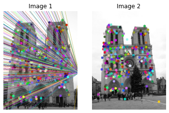
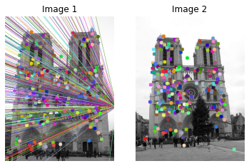
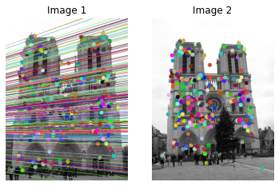
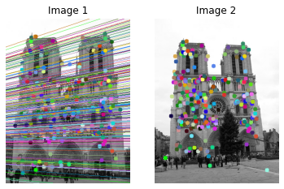

# ransac-and-eight-point-algorithm

## About

Finding the Fundamental Matrix of an un-calibrated camera using the eight point Algorithm and RANSAC algorithm.

## Steps

<ul>
  <li>Normalize the image points by transforming the centroid to the origin and by making the mean distance of the points to centroid equal to root 2.</li>
  <li>Form the matrix_A by using the corresponding keypoints from each image of a pair. Solve the matrix _A using SVD to obtain the funndamental matrix</li>
  <li>Enforce rank-2 condition on the fundamental matrix as it may not necessarily satisfy the rank-2 condition. Enforce this constraint explicitly using SVD by setting the last singular value to 0</li>
</ul>
 For RANSAC algorithm, at each step we randomnly select n points and find its fundamental matrix and evaluate it by finding the number of inliers. Thus after doing this iteratively for some K steps we arrive at a best fundamental matrix.

## Output of opencv's Eight point algorithm

## Output of own implementation of Eight point algorithm

## Output of opencv's RANSAC algorithm

## Output of own implementaion of RANSAC algorithm

